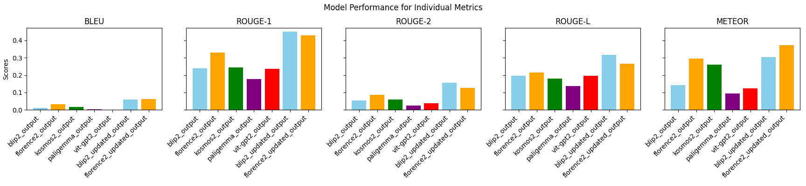

# 🧠 Caption Correction Efficiency Analysis

This analysis evaluated the tradeoff between editing model-generated image captions and writing captions from scratch. It includes assessments based on two vision-language models: **BLIP-2** and **Florence**. Captions were generated utilizing Blip2-opt2 and Florence 2. Those captions were then reviewed with their source image and edited directly in a copy of the JSON by the evaluator to eliminate hallucinations, extraneous text, and add descriptive detail as deemed necessary. The evaluations of BLEU, METEOR, and ROUGE were re-run with the updated captions and their performance improved.

---

## 📁 Files and Structure

The working directory includes the following key file types:

- `blip2_modelOutput.json`  
  Raw captions generated by the BLIP-2 model.

- `florence_modelOutput.json`  
  Raw captions generated by the Florence model.

- `blip2_humanCorrectedOutput.json`  
  Manually corrected captions based on BLIP-2 outputs.

- `florence_humanCorrectedOutput.json`  
  Manually corrected captions based on Florence outputs.

- `captionMetrics.png`
  Graphical representation of metrics before and after changes.

- `evaluation_humanCorrectedCOmparison_results.csv`
  Measurements of performance before and after corrections.

- `word_count_AddRemoveSummaryCompare.json`
  Word count of the additions and deletions made by the human to the models' captions.
---

## 🕒 Efficiency Summary

- ⏱ **Writing from scratch**: ~50 seconds per caption (average).
- ✏️ **Editing model captions**: ~68 seconds per caption (average).
- 🔍 **Conclusion**: Despite metric improvements, editing took longer and still did not match the quality of human-written captions.

---

## 📊 Metric Comparison

The following plot compares evaluation metrics (e.g., BLEU, ROUGE, METEOR, CLIPScore) before and after correction for both models:

---

## 📌 Notes

- Word-level diffs were computed by comparing tokenized captions before and after correction.
